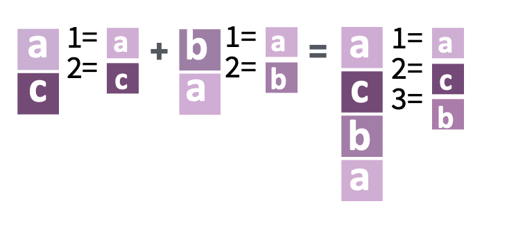

```{r setup, include=FALSE}
options(htmltools.dir.version = FALSE)
library(tidyverse)
```

```{r xaringan-themer, include=FALSE, warning=FALSE}
library(xaringanthemer)
style_mono_accent(
  base_color = "#23373B",
  header_font_google = google_font("Josefin Sans"),
  text_font_google   = google_font("Montserrat", "300", "300i"),
  code_font_google   = google_font("Fira Mono")
)
```

```{css, echo=FALSE}
/*.columns { display: flex; }*/

a, a > code {
  color: rgb(249, 38, 114); || sets color of links */
  text-decoration: none; /* turns off background coloring of links */
}

.title-slide {
  background-color: #23373B;
  border-top: 80px solid #23373B;
}

.title-slide h1  {
  color: #FFFFFF;
  font-size: 40px;
  text-shadow: none;
  font-weight: 400;
  text-align: left;
  margin-left: 15px;
  padding-top: 80px;
}

.title-slide h2  {
  margin-top: -25px;
  padding-bottom: -20px;
  color: #FFFFFF;
  text-shadow: none;
  font-weight: 300;
  font-size: 35px;
  text-align: left;
  margin-left: 15px;
}
.title-slide h3  {
  color: #FFFFFF;
  text-shadow: none;
  font-weight: 300;
  font-size: 25px;
  text-align: left;
  margin-left: 15px;
  margin-bottom: -30px;
}

hr, .title-slide h2::after, .mline h1::after {
  content: '';
  display: block;
  border: none;
  background-color: rgb(249, 38, 114);
  color: rgb(249, 38, 114);
  height: 2px;
}

h1 code, h2 code, h3 code, h4 code, h5 code {
    background-color: #f5f5f5;  /* This is a light gray color. Modify as needed. */
    color: #333;                /* This is almost black. Modify as desired. */
    padding: 2px 5px;           /* Adjusts the padding around the inline code */
}


.pull-left {
  padding-top: 0px;
}

.pull-left-narrow {
  float: left;
  width: 15%;
  padding-bottom: 5px
}

.pull-right-wide {
  float: right;
  width: 85%;
  padding-top: 0;
  padding-bottom: 5px/* Set to 0 or any value you feel looks right */
}

.pull-right-wide-2{
  float: right;
  width: 85%;
  padding-top: 30px;
  padding-bottom: 0px/* Set to 0 or any value you feel looks right */
}


.column {
  float: left;
  width: 20%;
  padding: 3px;
  box-sizing: border-box; /* Include padding in the width calculation */
}

```

# Table of Contents

.pull-left[
**janitor**
- Introduction to `janitor`
- Cleaning Names with `clean_names()`
- Tabulating Data with `tabyl()`
- Hands-on with `janitor`: Public Innovation Lab in Mexico
- Additional functionalities
]

.pull-right[
**forcats**
- Introduction to `forcats`
- Overview of Key `forcats` Functions
  - Inspect, Combine, and Modify Factors
  - Change Order, Value, and Add/Drop Levels
- Hands-on with `forcats`: A Small Example using `gss_cat`
]

---

# Introduction to Factors

Factors play an essential role when dealing with **categorical data** (variables that have a fixed and known set of possible values) in R.

> "A **factor** is an integer vector with a **levels** attribute that stores a set of mappings between integers and categorical values." - [Factors with forcats, RStudio](https://rstudio.github.io/cheatsheets/html/factors.html)

Key points about factors:
1. **Structured Representation**: Unlike character vectors, they don't need to follow alphabetical order.
2. **Tidyverse Compatibility**: Factors seamlessly integrate into the tidyverse ecosystem.


### Where could data scientists come across factors?
#### Surveys and Questionnaires:

- Questions with **multiple-choice** answers (e.g., "How satisfied are you with our service?" with responses: "Very Satisfied", "Satisfied", "Neutral", "Dissatisfied", "Very Dissatisfied").
- **Demographic data** like gender (e.g., "Male", "Female", "Other", "Prefer not to say").
---

# Say Hello to `forcats`

`forcats` is a member of the tidyverse family, dedicated to dealing with **categorical variables** in R.

.pull-left-narrow[.center[
  
]]
.pull-right-wide-2[
**Name Origin**: "for" + "cats" - because it's for categorical variables ;-) 
]
<div style="clear:both;"></div>

**Installation**: To install, simply run:
```{r eval=FALSE}
install.packages("forcats")
# Or
install.packages("tidyverse")
```

**Key Functionalities**:
- Inspecting factor levels
- Changing order and value of levels
- Combining and expanding factors
- Handling missing values and unused levels

---
# Overview of (selected) `forcats` functions


.column[
**Inspect**
<br>
`fct_count()`
`fct_unique()`
]

.column[
**Combine**
<br>
`fct_c(...)`
]

.column[
**Change Order**
<br>
`fct_relevel()`
`fct_infreq()`
`fct_reorder()`
]

.column[
**Change Value(s)**
<br>
`fct_recode()`
`fct_lump_min()`
`fct_other()`
]

.column[
**Add or Drop**
<br>
`fct_drop()`
`fct_na_value_to_level()`
]

---

# Inspect Factors

.pull-left-narrow[
  
]
.pull-right-wide[
`fct_count(f, sort = FALSE, prop = FALSE)`  
Count the number of values with each level.
]
<div style="clear:both;"></div>

**Example**:
```{r}
f <- factor(c("apple", "banana", "apple", "cherry", "banana", "apple"))
fct_count(f)
```

---

# Inspect Factors (cont.)

.pull-left-narrow[
  
]
.pull-right-wide[
`fct_count(f, sort = FALSE, prop = FALSE)`  
Count the number of values with each level.
]
<div style="clear:both;"></div>

**Example**:
```{r, results = 'hide'}
fruits <- factor(c("apple", "banana", "apple", "cherry", "banana", "apple"))
fct_count(fruits)
```

.pull-left-narrow[

]
.pull-right-wide[
`fct_unique(f)` 
<br>
Return the unique values, removing duplicates.
]
<div style="clear:both;"></div>

**Example**:
```{r}
fct_unique(fruits)
```
---
# Combine Factors

.pull-left-narrow[
  
]
.pull-right-wide[
`fct_c(...)`  
Combine factors with different levels.
]
<div style="clear:both;"></div>

**Example**:
```{r}
f1 <- factor(c("a", "c"))
f2 <- factor(c("b", "a"))
fct_c(f1, f2)
```
---
# Combine Factors (cont.)

.pull-left-narrow[
  
]
.pull-right-wide[
`fct_c(...)`  
Combine factors with different levels.
]
<div style="clear:both;"></div>

**Example**:
```{r, results = 'hide'}
fct_c(f1, f2)
```

.pull-left-narrow[

]
.pull-right-wide[
`fct_unify(fs, levels = lvls_union(fs))`
<br>
Standardize levels across a list of factors.
]

<div style="clear:both;"></div>
**Example**:
```{r}
fct_unify(list(f2, f1))
```
---

# Change the Order of Levels

.pull-left-narrow[
  
]
.pull-right-wide[
`fct_infreq(f, ordered = NA)` 
<br>
Reorder levels by the frequency in which they appear in the data (highest frequency first).
]
<div style="clear:both;"></div>

**Example**:
```{r}
fruits <- factor(c("apple", "banana", "apple", "cherry", "banana", "apple"))
fct_infreq(fruits)
```

---

# Change the Order of Levels (cont.)

.pull-left-narrow[
  
]
.pull-right-wide[
`fct_infreq(f, ordered = NA)` 
<br>
Reorder levels by the frequency in which they appear in the data (highest frequency first).
]
<div style="clear:both;"></div>

**Example**:
```{r, results = 'hide'}
fruits <- factor(c("apple", "banana", "apple", "cherry", "banana", "apple"))
fct_infreq(fruits)
```

.pull-left-narrow[

]
.pull-right-wide[
`fct_inorder(f, ordered = NA)`
<br>
Reorder levels by the order in which they appear in the data.
]
<div style="clear:both;"></div>

**Example**:
```{r}
fct_inorder(fruits)
```
---

# Change the Value of Levels

.pull-left-narrow[
  
]
.pull-right-wide[
`fct_recode(f, ...)`  
Manually change levels.
]
<div style="clear:both;"></div>

**Example**:
```{r}
fruits <- factor(c("apple", "banana", "apple", "cherry", "banana", "apple"))
fct_recode(fruits, cherry = "apple")
```
---

# Change the Value of Levels (cont.)

.pull-left-narrow[
  
]
.pull-right-wide[
`fct_recode(f, ...)`  
Manually change levels.
]
<div style="clear:both;"></div>

**Example**:
```{r, results = 'hide'}
fruits <- factor(c("apple", "banana", "apple", "cherry", "banana", "apple"))
fct_recode(fruits, cherry = "apple")
```

.pull-left-narrow[
  
]
.pull-right-wide[
`fct_other(f, keep, drop, other_level = "Other")`  
Replace all levels not in `keep` with the value of `other`.
]
<div style="clear:both;"></div>

**Example**:
```{r }
fct_other(f, keep = c("banana", "cherry"))
```
---
# Add or Drop Levels

.pull-left-narrow[
  
]
.pull-right-wide[
`fct_drop(f)`  
Drop unused levels from a factor.
]
<div style="clear:both;"></div>

**Example**:
```{r}
vehicles <- factor(c("car", "bike", "bus"), 
                   levels = c("car", "bike", "bus", "train"))
# "train" is an unused level
fct_drop(vehicles)
```
---
# Add or Drop Levels (cont.)

.pull-left-narrow[
  
]
.pull-right-wide[
`fct_drop(f)`  
Drop unused levels from a factor.
]
<div style="clear:both;"></div>

**Example**:
```{r, results = 'hide'}
fct_drop(vehicles)
```

.pull-left-narrow[

]
.pull-right-wide[
`fct_na_value_to_level(f, level = "(Missing)")`
<br>
Convert NA to a specified level in a factor.
]

<div style="clear:both;"></div>

<div style="clear:both;"></div>
**Example**:
```{r}
vehicles_with_na <- factor(c("car", "bike", NA, "bus", NA, "car"), 
                           levels = c("car", "bike", "bus", "train"))
# Convert NA values to "train"
fct_na_value_to_level(vehicles_with_na, level = "train")
```

---
# Application

### Aggregating factor levels in `gss_cat` data

The `gss_cat` dataset provides a sample from the General Social Survey, a US survey by the NORC at the University of Chicago.

```{r comment='#'}
library(tidyverse)
head(gss_cat)
```
---
# Application (cont.)

### Aggregating factor levels in `gss_cat` data

The `gss_cat` dataset provides a sample from the General Social Survey, a US survey by the NORC at the University of Chicago.

```{r comment='#'}
relig_counts <- fct_count(gss_cat$relig)
head(relig_counts, 10)
```
---

# Application (cont.)

### Aggregating factor levels in `gss_cat` data

The `gss_cat` dataset provides a sample from the General Social Survey, a US survey by the NORC at the University of Chicago.

--

To simplify plots or tables, we often lump together the small groups of a factor. The `fct_lump_n()` function from the `forcats` package serves this purpose by grouping the smallest categories into "Other".

```{r}
library(forcats)
library(dplyr)

gss_cat %>%
  mutate(relig = fct_lump_n(relig, n = 4)) %>%
  count(relig) %>%
  filter(!relig == "None") %>%
  arrange(desc(n))
```
In this code:

- `fct_lump_n(relig, n = 3)` will keep the top 3 most frequent religions and lump the rest into the "Other" category.
- `filter(!relig == "None")` will remove the "None" category from the output.
- `arrange(desc(n))` arranges the levels in descending order.
---

# Application (cont.)

### Aggregating factor levels in `gss_cat` data

The `gss_cat` dataset provides a sample from the General Social Survey, a US survey by the NORC at the University of Chicago.

To simplify plots or tables, we often lump together the small groups of a factor. The `fct_lump_n()` function from the `forcats` package serves this purpose by grouping the smallest categories into "Other".

```{r results='hide'}
library(forcats)
library(dplyr)

gss_cat %>%
  mutate(relig = fct_lump_n(relig, n = 4)) %>%
  count(relig) %>%
  filter(!relig == "None") %>%
  arrange(desc(n))
```
In this code:

- `fct_lump_n(relig, n = 4)` will keep the top 4 most frequent religions and lump the rest into the "Other" category.
- `filter(!relig == "None")` will remove the "None" category from the output.
- `arrange(desc(n))` arranges the levels in descending order.
---
class: inverse, center, middle

# Thank you for watching!

---
class: inverse, center, middle

# Ready to become an expert in `janitor` and `forcats`?

Scan the QR code below join the quiz:


Or go to **menti.com** and enter the code **49 85 53 3**

---

# Resources

1. **forcats**:
   - Official R Documentation: [forcats.tidyverse.org](https://forcats.tidyverse.org/)
   - Wickham, H., & Grolemund, G. (2017). Factors. In R for Data Science (1st ed.). O’Reilly Media, Inc. (https://r4ds.had.co.nz/factors.html#factors)

2. **janitor**:
   - [Package janitor documentation](https://cran.r-project.org/web/packages/janitor/janitor.pdf)
   - [GitHub Repository](https://github.com/sfirke/janitor)


Feel free to reach out to instructors for any further guidance or resources!


